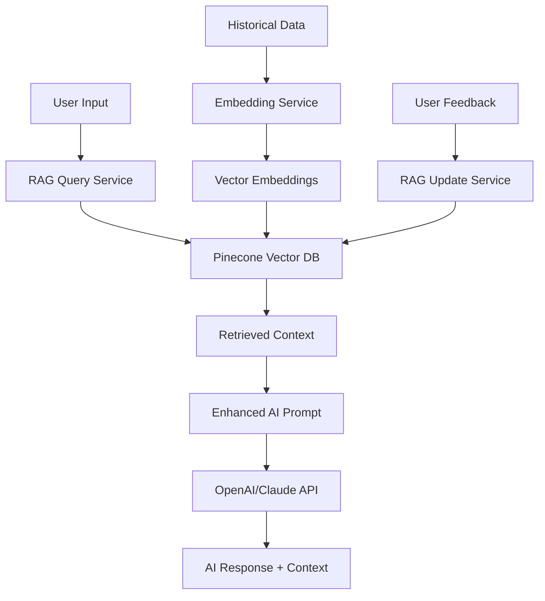

# Demo Scope Enhanced Design: RAG Integration & Before/After Comparison

## Overview

This document outlines the design for enhancing the Demo Scope functionality with:
1. **Before/After Photo Comparison** with AI feature extraction and analysis
2. **RAG (Retrieval-Augmented Generation) Integration** for historical case search and improved accuracy
3. **Modular Architecture** for reusable AI components across the system

## Current Architecture Analysis

### Existing Components
- **Frontend**: `DemoScope.jsx` - Main form with manual surface input and AI analysis
- **DemoAnalysisModule**: Single image analysis with area detection
- **AI Service**: OpenAI/Ollama integration for image processing
- **Database**: SQLite with demo_ai_analysis table for storing results

### Current Workflow
1. User uploads room images → AI analyzes → Detects demolition areas → User applies to form
2. Manual surface entry with AI area calculation support
3. Auto-save functionality with database persistence

## Enhanced Design Architecture

### 1. RAG Integration Architecture



#### Core RAG Components

**1. RAG Utilities Module (`backend/services/rag_utils.py`)**
```python
class RAGService:
    def __init__(self):
        self.pinecone_client = PineconeClient()
        self.embedding_model = SentenceTransformer('all-MiniLM-L6-v2')
        self.indices = {
            'demo-scope': 'demo-scope-index',
            'material': 'material-index',
            'work-scope': 'work-scope-index'
        }
    
    def get_rag_chain(self, index_name: str, query: str, k: int = 5):
        # Search Pinecone → Generate embeddings → Return relevant docs
        
    def create_enhanced_prompt(self, base_prompt: str, context_docs: List[str]):
        # Combine base prompt with RAG context
        
    def update_knowledge_base(self, feedback_data: Dict):
        # Update vector store with user feedback
```

**2. Embedding Pipeline**
- **Model**: `sentence-transformers/all-MiniLM-L6-v2`
- **Input Sources**: Historical demo scope data, material analysis results, user feedback
- **Vector Dimensions**: 384 (optimized for speed and accuracy)

**3. Index Strategy**
- **demo-scope-index**: Historical demolition patterns, area calculations, material types
- **material-index**: Material identification, scope definitions, cost patterns
- **work-scope-index**: Work procedures, estimates, completion data

### 2. Before/After Comparison System

#### Component Architecture

**1. Enhanced DemoAnalysisModule**
```jsx
const DemoAnalysisModule = ({
  mode = 'comparison', // 'single', 'comparison', 'analysis'
  onBeforeAfterAnalysis,
  ragEnabled = true
}) => {
  // New comparison workflow
  const [beforeImages, setBeforeImages] = useState([]);
  const [afterImages, setAfterImages] = useState([]);
  const [comparisonResults, setComparisonResults] = useState(null);
  
  const analyzeBeforeAfter = async () => {
    // 1. Extract features from both image sets
    // 2. Send to RAG-enhanced comparison API
    // 3. Return detailed demolition analysis
  };
};
```

**2. Before/After Comparison API**
```python
@router.post("/api/demo-analysis/compare-before-after")
async def compare_before_after(
    before_images: List[UploadFile],
    after_images: List[UploadFile],
    room_context: Dict,
    session_id: str
):
    # 1. Extract features from before/after images
    before_features = await extract_image_features(before_images)
    after_features = await extract_image_features(after_images)
    
    # 2. RAG enhancement - search for similar cases
    rag_context = await rag_service.get_rag_chain(
        'demo-scope', 
        f"similar demolition: {room_context['type']} {before_features['materials']}"
    )
    
    # 3. Enhanced comparison prompt
    comparison_prompt = f"""
    두 사진 비교 분석:
    
    Before Features: {before_features}
    After Features: {after_features}
    Similar Cases: {rag_context}
    
    철거 영역을 식별하고 정확한 수치를 계산하세요.
    불확실한 경우 '추정'으로 표시하세요.
    """
    
    # 4. AI analysis with enhanced context
    result = await ai_service.analyze_with_rag(comparison_prompt)
    return result
```

### 3. Workflow Manager

**Enhanced AI Pipeline (`backend/services/workflow_manager.py`)**
```python
class WorkflowManager:
    def __init__(self):
        self.rag_service = RAGService()
        self.ai_service = AIService()
        
    async def execute_demo_analysis_chain(self, request_data: Dict):
        """Execute complete demo analysis with RAG enhancement"""
        
        # 1. Determine analysis type
        analysis_type = request_data.get('type', 'single')
        
        # 2. RAG context retrieval
        rag_context = await self._get_rag_context(request_data)
        
        # 3. Execute appropriate analysis chain
        if analysis_type == 'comparison':
            return await self._execute_comparison_chain(request_data, rag_context)
        elif analysis_type == 'single':
            return await self._execute_single_analysis_chain(request_data, rag_context)
            
    async def _get_rag_context(self, request_data: Dict):
        """Get relevant historical context for analysis"""
        query_terms = [
            request_data.get('room_type', ''),
            ', '.join(request_data.get('materials', [])),
            request_data.get('analysis_focus', 'demolition')
        ]
        
        return await self.rag_service.get_rag_chain(
            'demo-scope', 
            ' '.join(query_terms),
            k=5
        )
```

### 4. Database Schema Enhancements

**New Tables for RAG Integration**

```sql
-- RAG Knowledge Base
CREATE TABLE rag_documents (
    id TEXT PRIMARY KEY,
    document_type TEXT NOT NULL, -- 'demo-scope', 'material', 'work-scope'
    content TEXT NOT NULL,
    metadata JSON,
    embedding_vector BLOB,
    created_at TIMESTAMP DEFAULT CURRENT_TIMESTAMP,
    updated_at TIMESTAMP DEFAULT CURRENT_TIMESTAMP
);

-- Before/After Analysis Results
CREATE TABLE demo_comparison_analysis (
    analysis_id TEXT PRIMARY KEY,
    session_id TEXT NOT NULL,
    room_id TEXT NOT NULL,
    before_images JSON NOT NULL,
    after_images JSON NOT NULL,
    before_features JSON,
    after_features JSON,
    comparison_results JSON,
    rag_context JSON,
    confidence_score REAL DEFAULT 0.8,
    user_feedback JSON,
    created_at TIMESTAMP DEFAULT CURRENT_TIMESTAMP,
    FOREIGN KEY (session_id) REFERENCES pre_estimate_sessions(session_id)
);

-- RAG Feedback for Continuous Learning
CREATE TABLE rag_feedback (
    id TEXT PRIMARY KEY,
    analysis_id TEXT NOT NULL,
    feedback_type TEXT NOT NULL, -- 'positive', 'negative', 'correction'
    feedback_data JSON,
    user_corrections JSON,
    created_at TIMESTAMP DEFAULT CURRENT_TIMESTAMP
);

-- Index for performance
CREATE INDEX idx_rag_documents_type ON rag_documents(document_type);
CREATE INDEX idx_demo_comparison_session ON demo_comparison_analysis(session_id);
CREATE INDEX idx_rag_feedback_analysis ON rag_feedback(analysis_id);
```

### 5. Frontend Component Design

#### Enhanced UI Components

**1. BeforeAfterComparison.jsx** (New)
```jsx
const BeforeAfterComparison = ({ onAnalysisComplete, sessionId, roomData }) => {
  const [beforeImages, setBeforeImages] = useState([]);
  const [afterImages, setAfterImages] = useState([]);
  const [analysisResults, setAnalysisResults] = useState(null);
  const [ragPreview, setRagPreview] = useState(null);
  const [debugMode, setDebugMode] = useState(false);

  return (
    <div className="before-after-comparison">
      <div className="upload-sections">
        <div className="before-section">
          <h4>Before Photos</h4>
          <ImageUploader onImagesUploaded={setBeforeImages} />
        </div>
        
        <div className="after-section">
          <h4>After Photos</h4>
          <ImageUploader onImagesUploaded={setAfterImages} />
        </div>
      </div>
      
      {ragPreview && debugMode && (
        <div className="rag-preview">
          <h5>Similar Cases Found:</h5>
          <RagContextPreview context={ragPreview} />
        </div>
      )}
      
      <ComparisonResults results={analysisResults} />
    </div>
  );
};
```

**2. RagContextPreview.jsx** (New)
```jsx
const RagContextPreview = ({ context, debugMode }) => {
  return (
    <div className="rag-context-preview">
      {context.map((doc, idx) => (
        <div key={idx} className="context-card">
          <div className="confidence">Score: {doc.score.toFixed(3)}</div>
          <div className="content">{doc.content.substring(0, 200)}...</div>
          {debugMode && <div className="metadata">{JSON.stringify(doc.metadata)}</div>}
        </div>
      ))}
    </div>
  );
};
```

### 6. Implementation Phases

#### Phase 1: RAG Foundation (Week 1-2)
1. **Setup Pinecone Vector Database**
2. **Implement RAG Service** (`rag_utils.py`)
3. **Create Embedding Pipeline** for existing data
4. **Database Schema Updates**

#### Phase 2: Before/After Comparison (Week 2-3)
1. **Enhanced DemoAnalysisModule** with comparison mode
2. **Image Feature Extraction** API endpoints
3. **Comparison Analysis** with RAG integration
4. **Frontend UI Components** for before/after workflow

#### Phase 3: Integration & Optimization (Week 3-4)
1. **Workflow Manager** implementation
2. **RAG Query Optimization** (Top-K tuning)
3. **Feedback Loop** for continuous learning
4. **Performance Testing** and optimization

#### Phase 4: Advanced Features (Week 4-5)
1. **Debug Mode Toggle** for RAG insights
2. **Confidence Thresholds** and uncertainty handling
3. **Advanced Prompt Engineering** with context
4. **User Experience Refinements**

### 7. Configuration & Environment

**Environment Variables**
```bash
# RAG Configuration
PINECONE_API_KEY=your_pinecone_key
PINECONE_ENVIRONMENT=us-west1-gcp
PINECONE_INDEX_NAME=mj-estimator-rag

# Embedding Model
EMBEDDING_MODEL=sentence-transformers/all-MiniLM-L6-v2
EMBEDDING_DIMENSION=384

# RAG Settings
RAG_TOP_K=5
RAG_SIMILARITY_THRESHOLD=0.7
RAG_DEBUG_MODE=false
```

**Dependencies**
```python
# New requirements
pinecone-client==2.2.4
sentence-transformers==2.2.2
faiss-cpu==1.7.4  # Alternative to Pinecone for local development
```

### 8. Quality Assurance & Testing

#### Testing Strategy
1. **Unit Tests** for RAG components
2. **Integration Tests** for before/after workflow
3. **Performance Tests** for vector search
4. **User Acceptance Tests** for accuracy improvements

#### Success Metrics
- **Accuracy Improvement**: 20%+ increase in demolition area detection
- **User Confidence**: Reduced manual corrections by 30%
- **Response Time**: <2 seconds for RAG-enhanced analysis
- **User Satisfaction**: 4.5+ rating for new comparison feature

### 9. Security & Privacy

#### Data Protection
- **Image Encryption** for uploaded photos
- **Vector Anonymization** for sensitive project data
- **Access Control** for RAG knowledge base
- **GDPR Compliance** for user feedback data

#### API Security
- **Rate Limiting** for AI analysis endpoints
- **Input Validation** for uploaded images
- **Authentication** for RAG admin functions

### 10. Monitoring & Maintenance

#### Observability
- **RAG Query Performance** metrics
- **Vector Search Quality** monitoring
- **User Feedback Analytics** for continuous improvement
- **Error Tracking** for AI analysis failures

#### Maintenance Tasks
- **Weekly RAG Index Updates** from new project data
- **Monthly Model Performance Reviews**
- **Quarterly User Feedback Analysis**
- **Continuous Prompt Optimization**

---

## Summary

This enhanced Demo Scope design provides:

1. **Intelligent Before/After Comparison** with AI feature extraction
2. **RAG-Enhanced Analysis** using historical project data
3. **Modular Architecture** for reusable AI components
4. **Continuous Learning** through user feedback loops
5. **Scalable Infrastructure** for future AI enhancements

The implementation prioritizes accuracy, user experience, and system maintainability while providing a foundation for advanced AI features across the entire MJ Estimator platform.